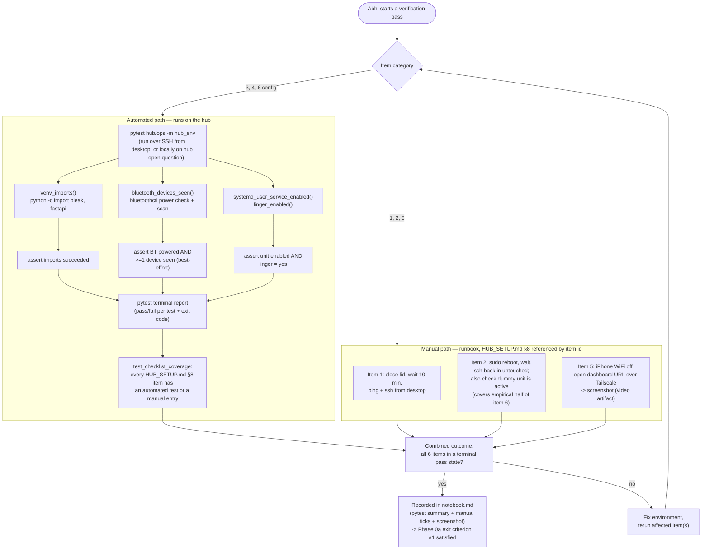
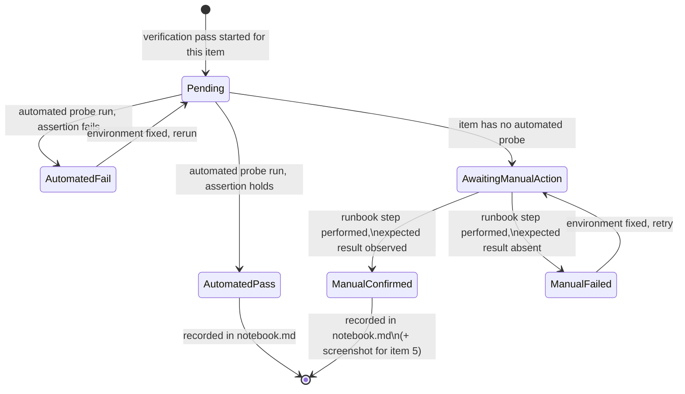
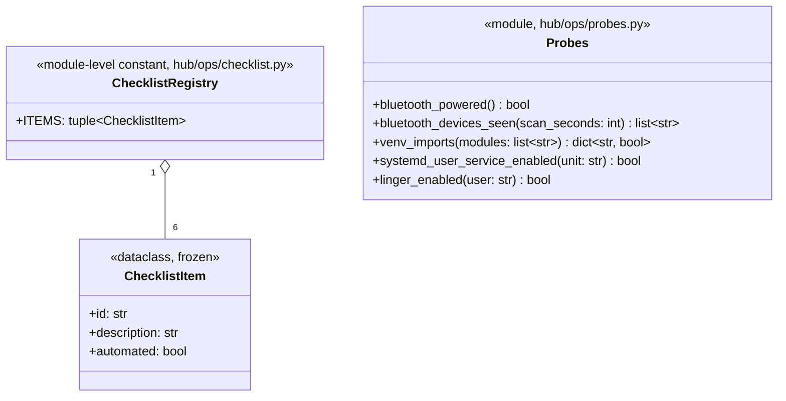

# Design 01 — Hub environment verification

Task 1 of `TASKS.md`. Design doc only, per CLAUDE.md's design-before-code rule — no
implementation until Abhi reviews and approves in a follow-up message.

## Purpose and scope

HUB_SETUP.md §8 lists six checklist items as the gate for "hub foundation plug-and-play
ready before rings arrive" (PLAN.md's stated top priority) and as one of Phase 0a's three
exit criteria ("hub passes its verification checklist"). Doing this by eyeballing
terminal output once and moving on isn't reviewable or repeatable — the goal of this task
is a small, proportionate piece of tooling plus a short runbook that together make "is
the hub actually ready" a repeatable, checkable question, not a memory.

The six items split cleanly into two categories by nature, and the design follows that
split rather than forcing everything into one shape:

| # | Item | Nature |
| --- | ------ | -------- |
| 1 | Lid closed 10 min → answers ping + SSH | Manual, time-gated |
| 2 | Survives reboot → SSH back in untouched | Manual, time-gated |
| 3 | `bluetoothctl scan on` sees nearby BLE devices | Scriptable, but environment-dependent (needs *some* nearby BLE advertiser; no ring exists yet) |
| 4 | Python venv imports bleak + fastapi | Fully scriptable, deterministic |
| 5 | Tailscale: iPhone reaches hub with WiFi off (cellular) | Manual — needs a second physical device; explicitly the video's privacy-segment demo shot per HUB_SETUP.md, so it should stay human-performed and screenshotted, not automated away |
| 6 | Dummy systemd user service starts on boot with linger enabled | Config is scriptable (`systemctl --user is-enabled`, `loginctl show-user --property=Linger`); the *empirical* "survives boot" part piggybacks on item 2's reboot rather than needing its own reboot |

A pure verification *script* undersells items 4 and 6 (throws away pytest's existing
pass/fail/report machinery for no reason), and a pure *manual runbook* undersells items 3,
4, 6 (loses repeatability on the parts that don't need a human at all). The design is a
**hybrid, and specifically a pytest-based hybrid**: CLAUDE.md already names pytest as the
one testing dependency this repo uses, and "server-state assertions via pytest" is a
recognized, minimal-dependency pattern (the same idea behind tools like
`pytest-testinfra`) rather than a new framework being introduced. Items 1, 2, 5 get a
short runbook (referencing HUB_SETUP.md §8 by item id, not duplicating it into a second
document) instead of test code, since no script on the hub *or* the desktop can toggle an
iPhone's WiFi or observe a 10-minute wall-clock wait meaningfully.

**Critical placement constraint:** this suite must run on the hub (Linux Mint), never
assumed to pass on the Windows desktop dev machine. `bluetoothctl`, `rfkill`,
`systemctl --user`, `loginctl` are Linux/hub-only tools that don't exist on this Windows
desktop environment. If these tests were unmarked and mixed into the default `pytest` run
CLAUDE.md describes ("Tests: `pytest` from repo root"), a plain desktop-side test run
would break on tooling that was never supposed to run there. So this suite must be
excluded from the default collection (a custom marker, e.g. `hub_env`, excluded via
`pyproject.toml`/`pytest.ini` `addopts = -m "not hub_env"`) and only invoked explicitly,
on the hub.

**Sequencing note:** at Task 1 time, `hub/api.py` doesn't exist yet (that's Task 7) —
HUB_SETUP.md §8 item 6 says "**dummy** systemd user service" for exactly this reason. The
probe for that item takes the unit name as a parameter rather than hardcoding
`ring-dashboard`, since Task 1 targets a throwaway placeholder unit and Task 7 stands up
the real one later, reusing the same mechanics this task proves out.

## Flow diagram



## State diagram

A single automated pytest *run* isn't meaningfully stateful — six independent,
order-agnostic pass/fail predicates evaluated once, with pytest's own
collected/passed/failed/error model already covering everything that model needs. No
state machine is invented for that half; it would duplicate what pytest already gives for
free.

Where state *is* genuinely worth modeling is the **verification session as a whole**,
because it spans real time and multiple human actions: Abhi runs the automated checks in
one sitting, then comes back later (minutes for the lid-closed check, potentially a
different session entirely for the reboot check) to close out the manual items.
Per-checklist-item, that's a real small lifecycle worth one diagram:



The aggregate "hub verified" status is a trivial AND over the six items' terminal states
(`AutomatedPass` or `ManualConfirmed`) — deliberately not diagrammed separately, since a
second state machine for a six-way boolean AND would be over-engineering for a personal
project checklist.

## Class diagram

A deliberately thin structure is proposed, with a rejected richer alternative shown for
comparison.

**Recommended (minimal):**



`ChecklistItem`/`ChecklistRegistry` exist for one reason: a single source of truth
mirroring HUB_SETUP.md §8's six bullets, so a `test_checklist_coverage` test can assert
every item is accounted for (automated test or documented manual step) and catch drift if
the checklist doc ever changes without the suite following. `Probes` are plain functions,
not a class — each is a small, single-purpose wrapper around one subprocess/import call
returning plain data (`bool`, `list[str]`, `dict[str, bool]`); the pytest `test_*`
functions call these and assert directly, matching CLAUDE.md's "small pure functions"
bias and mirroring the parser pattern (probe → structured data; test asserts against
expected), rather than the parser fixture pattern's fixture-vs-code split, which doesn't
map cleanly onto live-machine state.

**Rejected:** a parallel `CheckOutcome` enum + `ProbeResult`/`CheckResult` dataclass
wrapping every probe's result. This would duplicate pytest's own pass/fail/error
reporting and exit code without adding capability, for a six-item personal-project
checklist. It would earn its keep only if Abhi wants a report format pytest's own
terminal output and exit code can't give (see open question 4) — e.g. a custom summary
table, or a machine-readable artifact beyond what's needed to eyeball six results and
write a notebook.md line.

## Proposed file layout (provisional, pending open question 1)

```text
hub/
  ops/
    __init__.py
    checklist.py                # ChecklistItem + ITEMS, mirrors HUB_SETUP.md §8
    probes.py                   # bluetooth_powered, venv_imports, etc.
    test_hub_environment.py     # one test per automated item (3, 4, 6) + test_checklist_coverage
                                 # marked `hub_env`, excluded from default `pytest` collection
```

The manual runbook is *not* a new document — items 1, 2, 5 are referenced by their
existing HUB_SETUP.md §8 bullet, avoiding a second copy of the same checklist text going
stale independently.

## Definition of done

- `pytest hub/ops -m hub_env`, run on the hub, passes for items 3, 4, 6 (config half).
- `test_checklist_coverage` confirms all six HUB_SETUP.md §8 items are accounted for
  (automated or manual, none silently missing).
- A default `pytest` invocation from repo root on the desktop PC does **not** attempt to
  collect or run this suite.
- Items 1, 2, 5 performed manually at least once, with item 5's screenshot captured
  (video/evidence artifact) and a notebook.md entry recording the full six-item outcome.

## Open questions

1. **Where does this live?** `hub/ops/` (lean: colocated with the one venv that actually
   has bleak/fastapi/pytest installed) vs. a new root-level `scripts/` or `ops/` dir vs.
   inside a future `hub/tests/` alongside application tests. CLAUDE.md says "prefer
   editing existing files... no speculative modules," so a new subdirectory under `hub/`
   should get an explicit nod before it's created.
2. **Invocation ergonomics.** Does Abhi SSH into the hub and run pytest locally each
   time, or is the desktop-side workflow `ssh hub "cd ~/projectring && pytest hub/ops -m
   hub_env"` as a one-liner (possibly Claude-Code-invoked)? Either way the check logic
   itself must execute on the hub, not the desktop — that part isn't in question, only
   how it's triggered.
3. **How should the manual/time-gated items appear in the tooling, if at all?** Three
   options, increasing in weight: (a) absent from pytest entirely, purely a runbook
   reference — simplest, current lean; (b) present as `pytest.mark.skip(reason=...)` stub
   tests so they show up in every run's skipped count as a standing reminder; (c) an
   interactive `--manual` mode that pauses and prompts, turning this from a batch script
   into a semi-interactive checklist tool — meaningfully heavier for a six-item personal
   checklist, worth sign-off before building.
4. **Report destination.** Is pytest's console output + a hand-written notebook.md entry
   sufficient evidence (current lean, matches existing "notebook entry every session"
   practice), or does Abhi want a structured artifact (`--junit-xml`, a custom summary) —
   the case where the rejected `CheckOutcome`/`CheckResult` classes above would actually
   earn their keep?
5. **BLE scan check tolerance.** No ring exists yet, so item 3 can only assert "some BLE
   device is visible nearby," which is environment-dependent (fails in a BLE-silent
   room). Hard-fail on zero devices, or warn/report-count without failing the run? Is a
   fixed precondition ("run with your phone's Bluetooth on in the room") acceptable to
   document?
6. **Checklist source of truth.** Hand-maintain `ChecklistItem.ITEMS` as a small constant
   mirroring HUB_SETUP.md §8's prose (simple, can drift if the doc changes and the
   constant isn't updated), or parse the six `- [ ]` lines directly out of HUB_SETUP.md at
   test-collection time (zero drift, but couples test code to markdown prose formatting)?
   Current lean is hand-maintained, given the doc changes rarely and the parsing approach
   is more machinery than six bullet points justify.
7. **Dummy systemd unit.** Should this task create a genuinely throwaway unit (e.g.
   `ExecStart=/bin/sleep infinity`) purely to prove enable+linger+boot-survival
   mechanics, to be discarded once Task 7's real `ring-dashboard.service` exists — or
   stand up the real skeleton from HUB_SETUP.md §6 now with a no-op `ExecStart` and let
   Task 7 fill it in later?
8. **Run history.** Is each verification pass fully stateless (rerun anytime, no history
   beyond whatever notebook.md entries Abhi writes by hand — the assumption throughout
   this design), or does Abhi want any persisted trend across repeated passes over time?
   Recommendation is against persistence for a personal project unless there's a concrete
   use for it.
